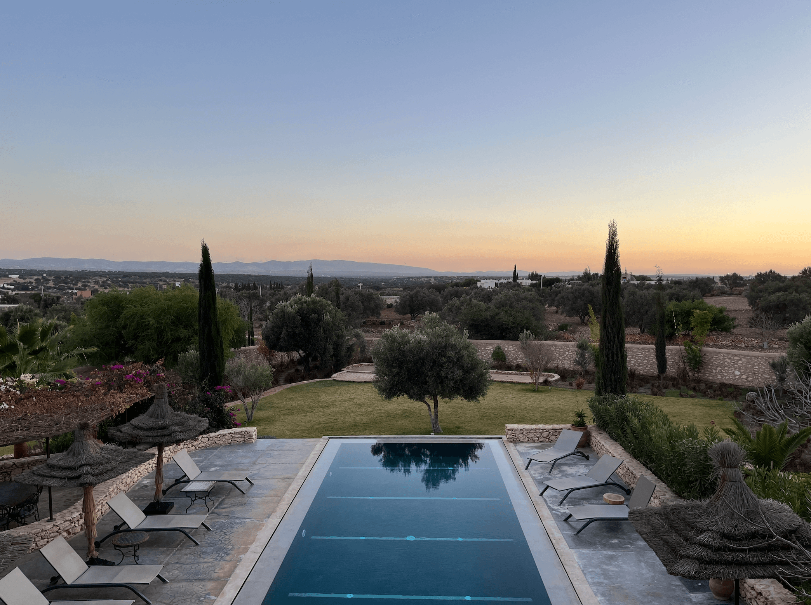
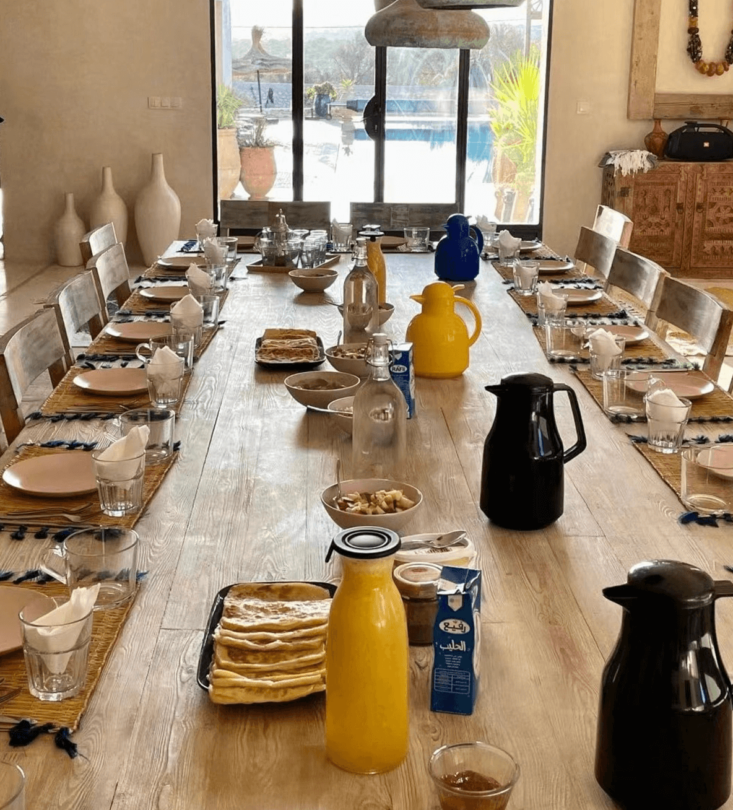
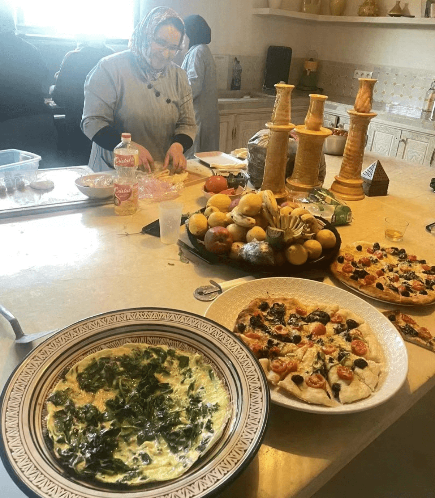
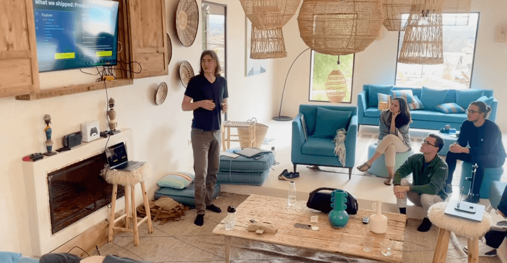
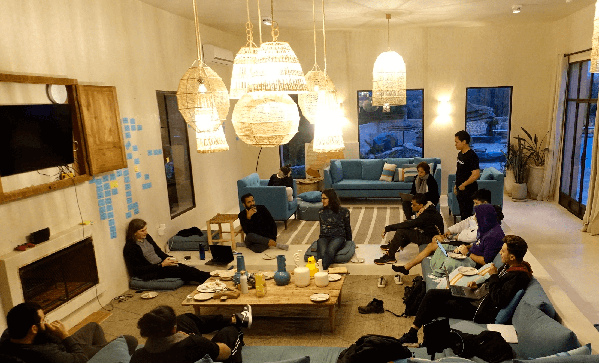
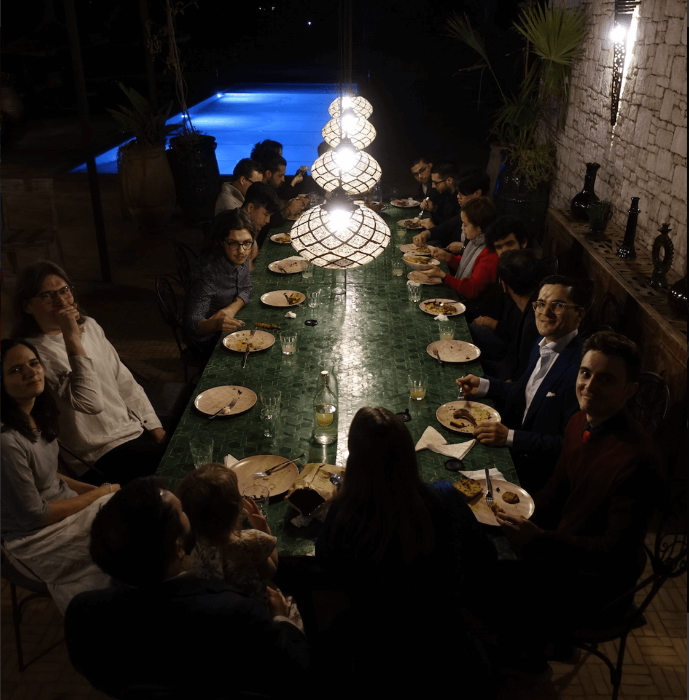
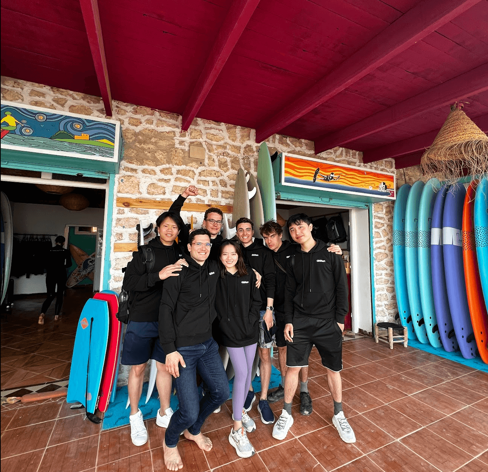

Staying in Essaouira was an absolute dream, thanks to the all-inclusive setup that catered to our every need from sunrise to sunset, immersing us in the local charm and energy 🌅. Waking up to breathtaking views every morning was a constant source of inspiration, connecting us even deeper to the enchanting spirit of the place ✨.

During our magical stay in Essaouira, we hit some impressive milestones: unveiling a fresh company brand, launching a sleek new website, and pulling off a dynamic 24-hour hackathon that took our platform to the next level, all amidst the stunning backdrop and strong camaraderie 🚀.

One of the highlights was the warm welcome we extended to our newest team members with a heartfelt ceremony that was nothing short of memorable. Diving into surf lessons together and savoring local delicacies not only sparked joy and laughter but also knitted us closer, transforming us into a tight-knit family 🏄‍♂️🍴. Those moments have definitely left a lasting imprint on our hearts.

