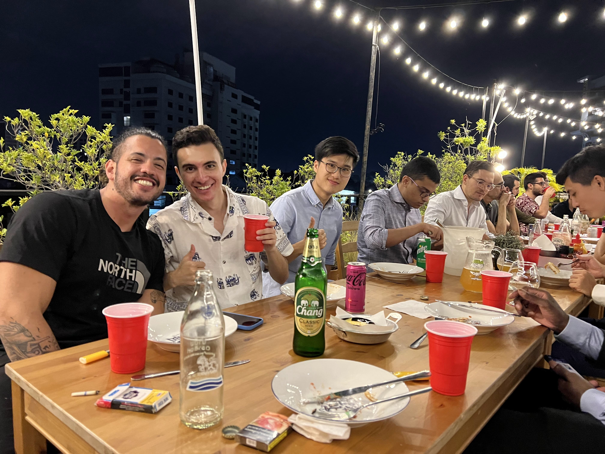

## Thailand onsite
One of our recent company onsites took us to the enchanting city of Chiang Mai, nestled amidst the natural beauty of northern Thailand. Chiang Mai's rich cultural heritage and picturesque landscapes set the stage for a truly memorable and productive experience for our team.

Our onsite experience included major conferences that delved into essential aspects of our company. We engaged in discussions about our company's mission and history, outlined our roadmap for the future, and identified key areas of focus. These sessions not only provided valuable insights but also strengthened the bonds within our team.

During our time in Chiang Mai, we immersed ourselves in a diverse range of activities that showcased the essence of this vibrant city. From invigorating hikes through lush forests to a heartwarming visit to an elephant sanctuary, we embraced the local way of life and gained valuable insights into the traditions that define Chiang Mai.

