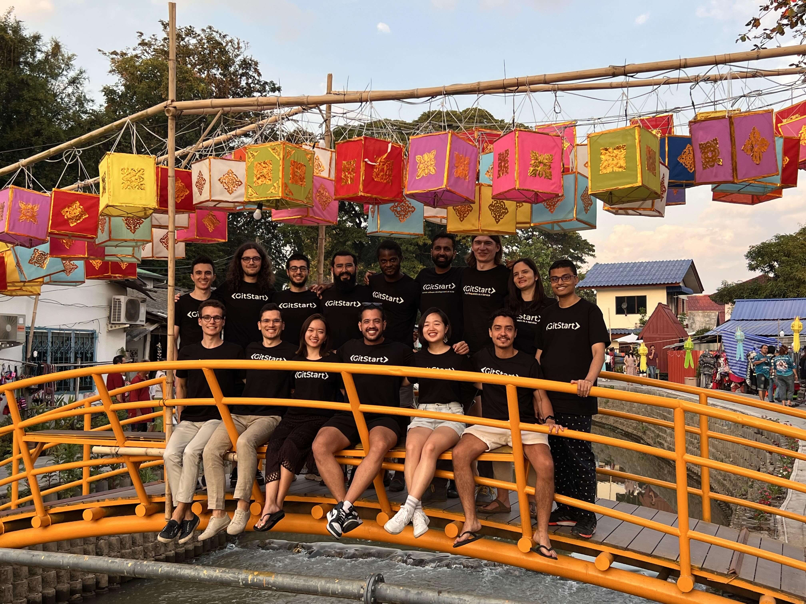
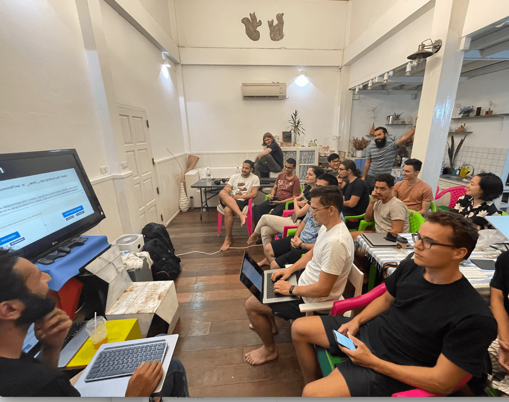
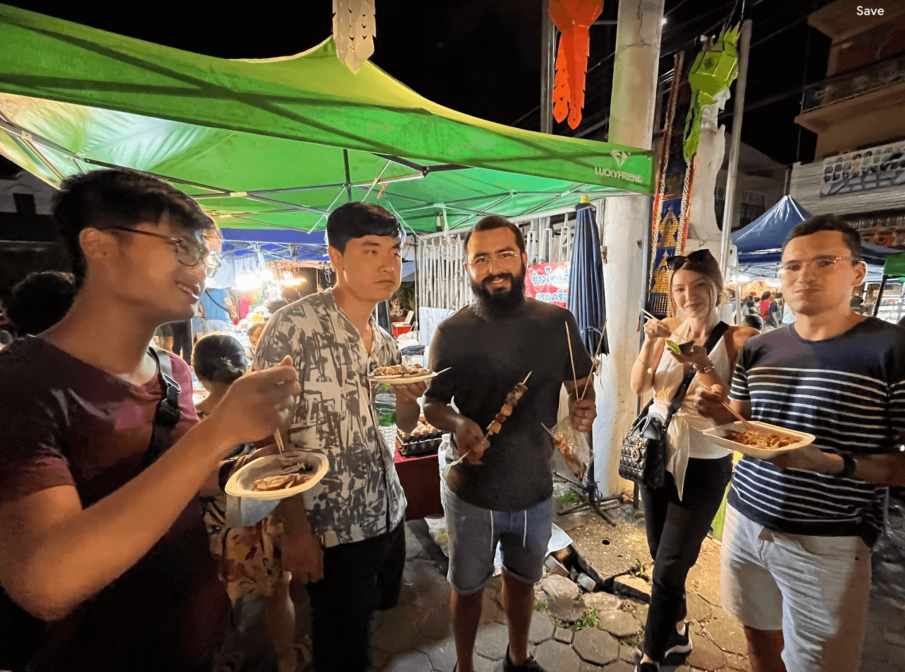
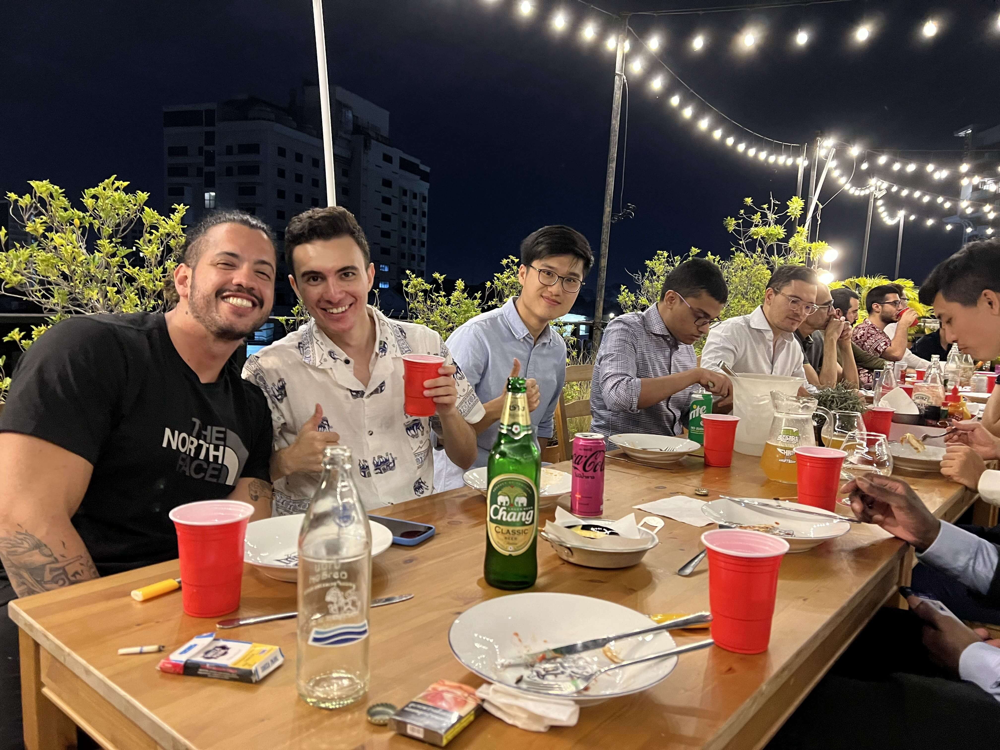
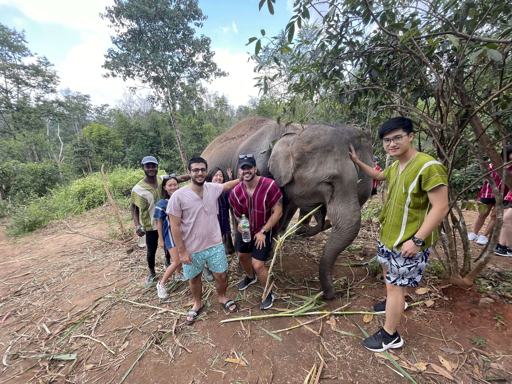

Our latest adventure whisked us away to the stunning city of Chiang Mai in northern Thailand, a place where the natural beauty and rich cultural tapestry create a mesmerizing setting. This city became the perfect stage for a week that was as enriching for our minds as it was memorable for our hearts 🌏✨.

In the heart of Chiang Mai, we immersed ourselves in deep-dive sessions, exploring the essence of our company's journey, vision, and key focuses. These gatherings were more than just meetings; they were heartfelt bonding experiences, where every conversation brought us closer as a team 🤝💡.

Yet, our trip was beautifully balanced with exploration and adventure. We embraced the splendor of Chiang Mai, trekking through lush landscapes and visiting an elephant sanctuary, which stood out as an extraordinary experience for many of us. These adventures allowed us to witness the vibrant hues and traditions of this unique city 🌿🐘.

This journey to Chiang Mai wasn't just a trip; it was a journey of connection, discovery, and unforgettable moments shared among not just colleagues, but friends 🚀🌟.

