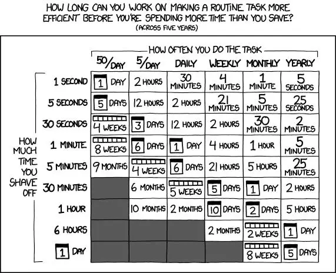
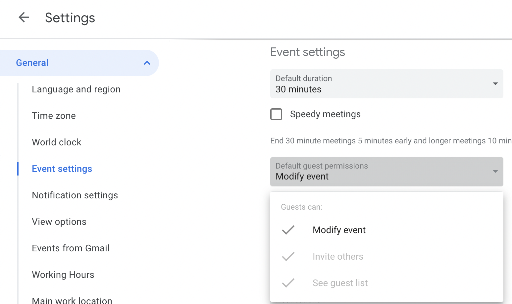
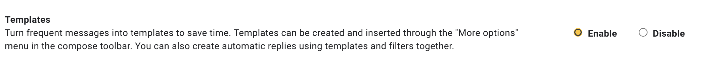

# Productivity

**Tools should work for us, not against us.** We don’t want to be slowed down by tools or spend too much mental bandwidth operating them. That time can be better spent elsewhere on difficult or creative tasks, which humans excel at.

<!--  -->

### Collaboration

- **Enable others to modify your calendar events**

    
    <!--  -->

- [**Join Tandem](https://tandem.chat) to ease remote collaboration**

    Don’t forget to add it as a login item

### Personalize your tools

- **In Linear, create and favorite a view with cards assigned to you.** Ensure you don’t miss cards assigned to you in teams/workspaces other than the one you use most.
- **Create sections in Slack**. [Organize your sidebar with commonly-used sections](https://slack.com/help/articles/360043207674-Organize-your-sidebar-with-custom-sections), keeping the most relevant channels at a glance.

### Save time typing or doing emails

Improve your typing speed or try text expanders and other snippet tools:

- **Check and improve your typing speed by taking a [typing speed test](https://10fastfingers.com/typing-test/english). T**yping is essential, and maybe you’ve never had to type very fast — but spend any time in an interview or meeting where you have to take notes, and that notion might change. Can you reach 500 keystrokes/minute? 💨
- **Get a tool like [aText](https://www.trankynam.com/atext/) to create commonly-used snippets.** If you have common phrases or templates that you need to use across platforms, it makes no sense to type them from scratch every time.
- **Enable Templates in Gmail.** You can find them in *Settings > Advanced.*

    

- **Create and use Templates in Notion.** Once you do, these will appear to anyone who wants to add a new page. That way, content stays consistent between team members, and it’s easier to read and talk about.
- **Learn how to use keyboard shortcuts in [Notion](https://www.makeuseof.com/notion-keyboard-shortcuts/), Gmail, Slack, and other tools** — and save yourself time, not just clicks. Developers love keyboard shortcuts, and others can benefit too. To help, you could buy and use [Mouseless](https://www.mouseless.app/), an app that will help you practice keyboard shortcuts.
    - Try using common tools without a mouse: Linear, Slack, Gmail, Chrome, [Notion](https://www.makeuseof.com/notion-keyboard-shortcuts/). Imagine being able to open Linear, create a card, add labels, assign it yourself, add priority level, estimate, and assign it to yourself without touching the mouse!
- **Take notes in a new Chrome tab with [Papier](https://chrome.google.com/webstore/detail/papier/hhjeaokafplhjoogdemakihhdhffacia) (Chrome Extension):**  Use it if you’re pressed for time, e.g., an interview, and can’t find built-in notes tools.

### Join and create meetings faster

*Note: these apps are only available for macOS.*

- **To join meetings, use [Meeter](https://apps.apple.com/us/app/meeter-for-zoom-teams-co/id1510445899).** Connect your calendar and see your next meeting in the status bar, along with a countdown timer. Join meetings straight from there instead of going to your Google Calendar. The former is more popular, with a configurable UI, and the latter is more minimalistic.
- **If you need to create meetings, use [Cron](https://cron.com/).** It gives superpowers to your usual calendar, enabling better time zone management, color-categorizing your events, and more control over the UI. Ask for an invitation from Hamza, Corentin, or in #ops.

### Power up your desktop

- [Yippie (macOS)](https://yippy.mattdavo.com/) It stores all that you have copied or cut in the past, allowing you to quickly find that snippet of text you've been looking for.
- [**Rectangle](https://rectangleapp.com) or Raycast (macOS):** Move and resize windows in macOS using keyboard shortcuts or snap areas. Finally, multiple windows, all tidy!
- **Make your mouse go faster (from your computer settings).**  Some of us have it set at the maximum. You’ll get used to it. It will be faster everywhere.
