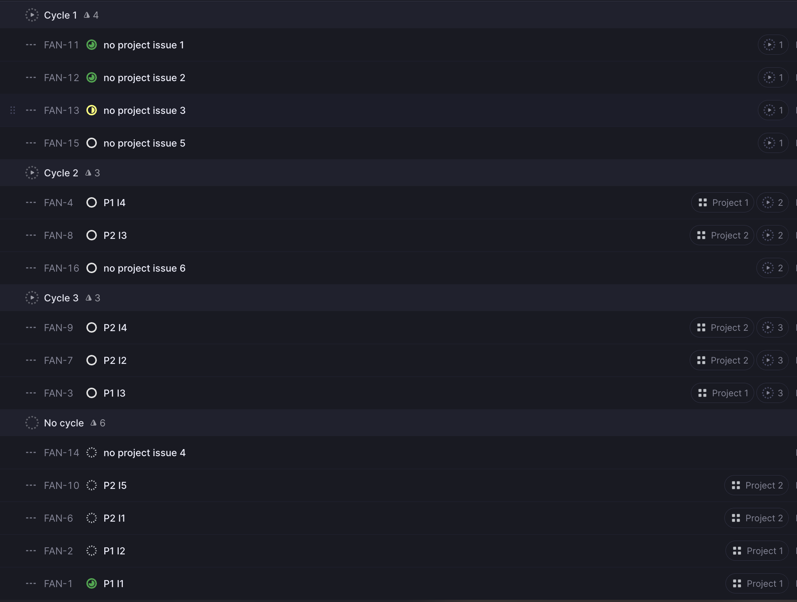
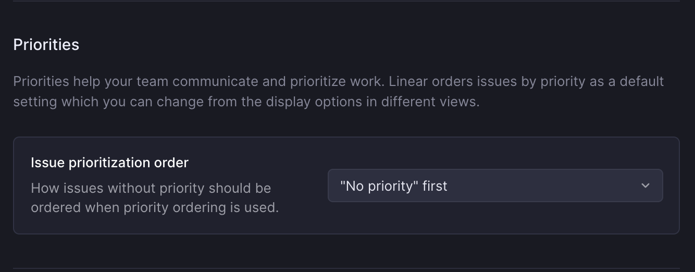
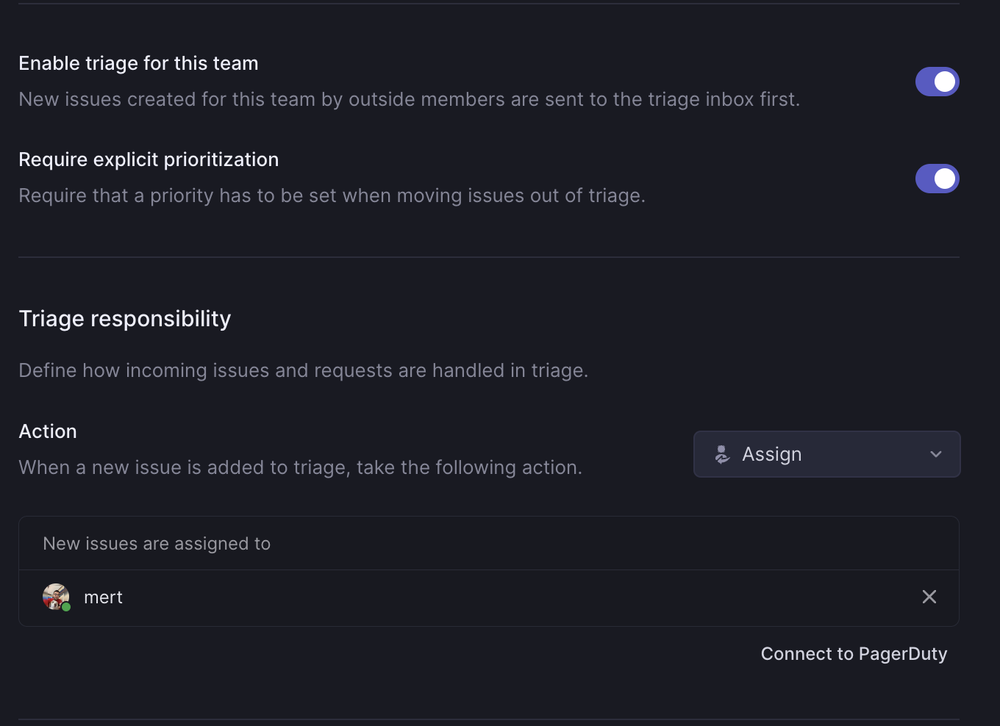
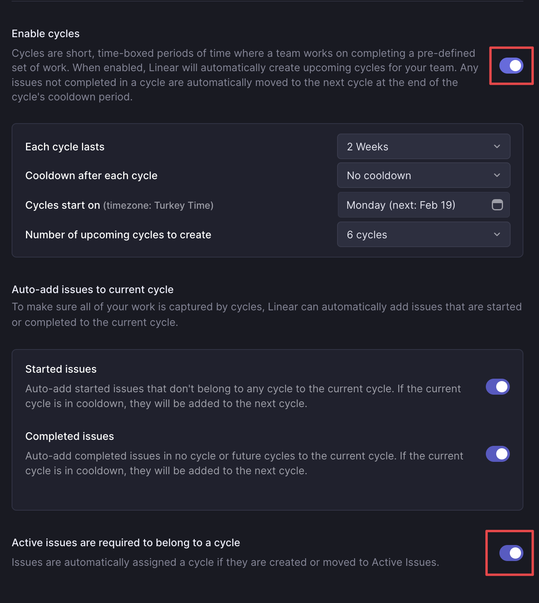

# Going Linearly

## Roadmaps

They have a theme and run on quarterly cycle. We hold the cross team to kick off quarter with roadmap meetings setting high level priorities for product, focus areas, initiatives (max x themes). This focuses resources and direction.

Open the floor on more executional matters -> transcribe to projects in each team to deliver on the theme.

You can see the high-level initiatives with a roadmap, but not day to day.

## Projects

They are created to layer and delegate (cross team accountability and supervision) execution. Teams can decide on their own priorities, each project should have a **cycle** limit if it falls into the roadmap.

Projects must fall within into the theme for the quarter.

✅ Projects are **needed** if something is going to take more than 1 week but less than 2.

✅ If the project is expected to take more than 2 weeks.
  - Scope it down
  - Reduce it to smaller deliverables

## Issues

They should describe a task with a clear, defined outcome. This could be a piece of code, design, document, or action to be taken. If it’s not a task, then it doesn’t belong in the issue tracker. It maybe a project and needs to be fleshed out.

**Everyone writes their own issues or if they're assigned an issue, they get to decide how to execute it.**

Issues don't need to belong to a project, but any issue that takes > 1 week should be a project.

**Every issue  MUST have a SINGLE owner, a due date and an outcome defined.**

## Cycles

1. Teams can decide the cycle duration on their own, and it enables everyone to have a clear view of what’s next in that team.
2. Issues that don't belong to a cycle are considered backlog.
3. Recommended view is grouping issues by the cycle:

## Team Settings

### General

**Make no priority visible.** This will help you assign a priority to each item.

### Triage

Enable triage and explicit prioritization. Give triaging responsibility to a person by default. This will help other teams to suggest you tasks.

### Cycles

Enable cycles, and make sure active issues are part of a cycle. Cycle names can be edited and it will apply to subsequent cycles. For example in Ops we use Week Numbers and our cycles are set to 1 week.

## FAQ

- How is the visibility of issues that don’t belong to a project?
    - [Issues without a project grouped by teams](https://linear.app/gitstart/view/f4946958-dae4-4a47-93e7-e2b6f6af5f18?layout=list&ordering=priority&grouping=team&showCompletedIssues=week&showSubIssues=true)
- What’s the best way to monitor recurring tasks?
    - For recurring issues that take a couple of days with multiple steps create a project template and run as necessary. House it in the “no roadmap” bucket
    - If the recurring task is more of a to do create an issue template and place in backlog/cycle
- Milestones?
    - Don't use for now - we will assess once projects are utilised company wide.
- What’s the best way to see what a team is doing?
    - Issues → Group by cycle.
- I have a project that does not fall neatly into a roadmap, what should I do?
    - Place it with no roadmap, it may be questioned by other as being of a critical nature or now. Projects which appear too random or vague should be reconsidered.
